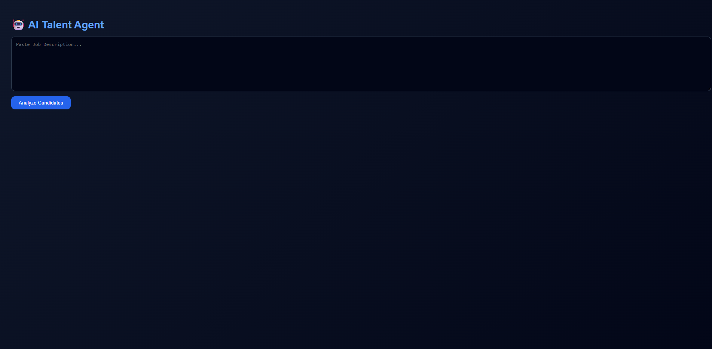

# 🤖 AI Talent Agent

An AI-powered recruitment assistant that automates candidate discovery, matching, and engagement using intelligent scoring and conversational interaction.

---

## 🚀 Features

* 📄 **Job Description Parsing**
  Extracts key skills, role, and experience from raw JD text.

* 🎯 **Candidate Matching Engine**
  Scores candidates based on:

  * Skill Match
  * Experience Match
  * Provides explainable results

* 💬 **AI Candidate Engagement**
  Simulates real-time chat with candidates (WhatsApp-style UI)

* 📊 **Ranking Dashboard**
  Visual ranking of candidates based on:

  * Match Score
  * Interest Score
  * Final Score

* 🌙 **Premium Dark UI**
  Clean, modern interface with animations

---

## 🏗️ Tech Stack

### Backend

* FastAPI
* Python
* Transformers (HuggingFace)

### Frontend

* React.js
* Framer Motion (animations)
* Recharts (charts)

---

## 📂 Project Structure

```
ai-talent-agent/
│
├── backend/
│   ├── app/
│   │   ├── main.py
│   │   ├── jd_parser.py
│   │   ├── matcher.py
│   │   ├── engagement.py
│   │
│   ├── data/
│   │   └── candidates.json
│   │
│   └── requirements.txt
│
├── frontend/
│   ├── src/
│   │   ├── App.js
│   │   ├── api.js
│   │   └── components/
│   │       ├── CandidateCard.js
│   │       ├── ChatBox.js
│   │       └── Dashboard.js
│
└── README.md
```

---

## ⚙️ Setup & Run

### 🔹 1. Clone Repository

```
git clone <your-repo-link>
cd ai-talent-agent
```

---

### 🔹 2. Backend Setup

```
cd backend
pip install -r requirements.txt
uvicorn app.main:app --reload
```

👉 Runs at: http://127.0.0.1:8000

---

### 🔹 3. Frontend Setup

```
cd frontend
npm install
npm start
```

👉 Runs at: http://localhost:3000

---

## 🧪 Sample Job Description

```
We are hiring a Software Engineer with experience in Java, SQL, Spring Boot, and React. 
Candidates should have 2+ years of experience and strong problem-solving skills.
```

---

## 🎯 How It Works

1. Paste Job Description
2. Click **Analyze**
3. View ranked candidates
4. Start chat with candidates
5. Evaluate interest level

---

## 🏆 Scoring Logic

* **Match Score** → Skill + Experience match
* **Interest Score** → Simulated AI response
* **Final Score** → Weighted combination

---

## 🚀 Future Improvements

* Real resume parsing (PDF upload)
* Live LinkedIn/GitHub integration
* Real LLM integration (OpenAI / APIs)
* Authentication system
* Recruiter dashboard

---

## 📸 Demo



---

## 🤝 Contribution

Feel free to fork and improve!

---

## 📜 License

MIT License

---

## 💡 Hackathon Note

This project demonstrates an end-to-end AI recruitment pipeline:

* Automated matching
* Conversational engagement
* Decision-ready ranking

---

🔥 Built to simulate real-world hiring automation workflows.
